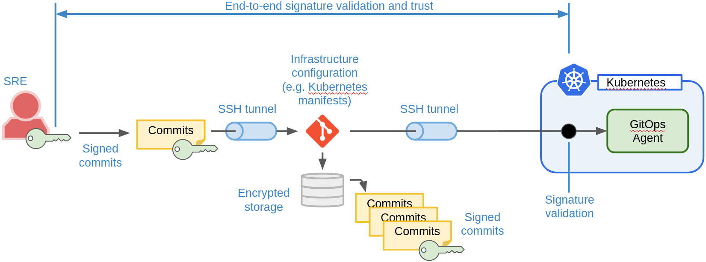
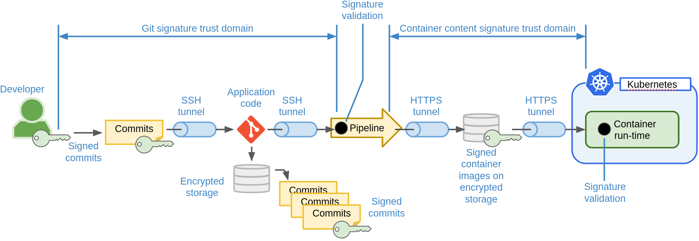
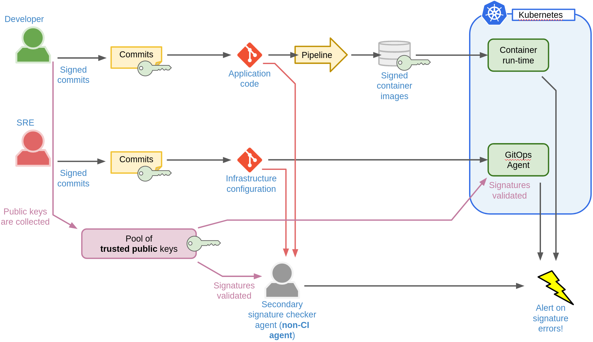

# Git Signature Checker

This repository contain a tool for validating Git Commit and Tag signatures.

## Introduction - The CIA Triad

When assessing risk, the CIA triad can be used as three corner-stones. The three
elements that make up the CIA triad are:

- **Confidentiality.** Protection and secrecy of information. This applies to
    both software algorithms, business processes and end-user data. Lost secrets
    may impact business competitive advantages, cause loss of end-user
    confidence or even legal actions (e.g. GDPR).

- **Integrity.** Tamper-protection of our information. This applies to both
    software artifacts and data, including end-user data. Lost integrity may
    result in our software platform being open for hackers and thereby **also
    cause loss of Confidentiality** on a wider scale.

- **Availability.** The availability of the service of our software. This
    applies both to how our infrastructure and applications are designed, but
    also how it might stand-up against e.g. malicious attacks. It also affect
    our processes, e.g. are we using sound DevOps processes that guarantee a
    short time-to-recover in case of down-time, where down-time may be caused by
    ourselves (e.g. software updates) or external events (e.g. disaster
    recovery).

## Security in Our Software Delivery Chain

The way we work with Git impact Confidentiality and Integrity of our software
delivery chain. Typically the following are used by developers to secure Git
operations:

- An **SSH-key** used to 1) encrypt our connection to the Git server through an
    SSH tunnel and 2) to authenticate us towards the Git server and authorize
    our actions.

- **HTTPS towards a Git Web UI**. The UI allows us to do most Git operations,
    except signing commits since the Web UI do not have access to our private
    signing key. It is not uncommon for corporate PCs to have custom root
    Certificate Authorities, i.e. the HTTPS encryption protecting the Git UI may
    not be end-to-end.

- **GPG signing keys** used to sign Git commits and tags. A signed commit/tag
    certify, that the commit/tag was done by someone with access to the private
    signing key.

## Protecting the Software Delivery Chain

Imagine an SRE who are using GitOps practices to manage a Kubernetes
platform. In this situation, the SRE will prepare Kubernetes manifests and store
them in Git. Inside the Kubernetes cluster a GitOps agent will pull the most
recent manifests from Git and apply them to Kubernetes. Thus, the state of
Kubernetes platform is defined fully by what are stored in Git. This is
illustrated below.



If the SRE signs all commits, the [GitOps agent can
verify](https://docs.fluxcd.io/en/1.19.0/references/git-gpg) Git commit
signatures before applying changes to Kubernetes. This provides **end-to-end
Integrity** in the delivery of infrastructure changes. This workflow also
illustrate the use of SSH-keys for accessing Git, i.e. we see SSH-tunnels
between the SRE and Git and similarly between Git and the GitOps
agent. SSH-tunnels provide **local confidentiality only** since the scope the
the tunnels are not end-to-end.

**Git signatures provide strong end-to-end integrity** which is important since
loss of integrity could also result in loss of confidentiality. Git SSH-keys for
accessing Git only provides local confidentiality.

The workflow for a developer which use a CI pipeline for building container
images look slightly different. Again we are assuming the developer signs
commits. The CI pipeline builds container images from Git source and should
validate Git signatures to establish trust between developer and pipeline. The
CI pipeline must also sign the built container image to ensure integrity between
the pipeline and Kubernetes through the container image registry (see [Docker
Content Trust](https://docs.docker.com/engine/security/trust)). This is
illustrated below.



In the developer workflow, **the CI pipeline may be a weak spot**, since it
performs complicated operations under control of the source application using
potentially a wide variety of tools. This means the CI pipeline have a large
attack surface. This weakness is amplified by the fact, that the CI pipeline
bridges trust from the developer signed commits to signed images validated
inside Kubernetes. If this trust bridging is compromised, e.g. by tricking the
CI pipeline to build from source which is not properly signed, **end-to-end
integrity is lost**.

To mitigate this, we should use an external agent to perform a secondary
verification of Git signatures. This check should be done by an agent that is
not directly related or impacted by the CI system, i.e. we assume it to be very
unlikely to be compromised simultaneously with the CI system.  The checker will
use the same public keys as the GitOps agent.

The external signature checker architecture is illustrated below.



To validate images we could use reproducible builds, however, this is rather
complicated in practice and not without its own problems. E.g. the pipeline
doing the secondary build must not be susceptible to the same attacks as the
primary pipeline.

## Using the Git Signature Checker

This repository contain a Git signature checker that can be used both in Ci
pipelines but also for the external git signature checker.

The checker needs a directory with public keys for all signing keys that should
be trusted. You can export your public GIt GPG key as follows, but note that you
need all public keys that are considered valid keys for signing:

```sh
gpg --armor --export user@acme.com > joe-pub-key.asc
```

Next, run the signature checker with a Git repository and your list of trusted public keys as follows:

```sh
docker run --rm -v $PWD/public-keys:/public-keys:ro -v $PWD/.git:/repo:ro michaelvl/git-signature-checker
```

## A Note on Public Keys

This tool does not validate the public keys or any trust between
them. Obviously, strong attention to key management is a prerequisite for
validating Git integrity with signatures.

## Caveates with Github Merges Through the Web UI

If you use the Github Web UI to merge PRs, your merges will be signed **with a
Github public key, not your own key**.  This **breaks end-to-end trust**,
because we cannot know who accessed the UI, possibly using a leaked
username/password.  You may consider merging PRs yourself, or you will need to
include the Github public key in the list of trusted signing keys. The key can
be found here:

```sh
curl https://github.com/web-flow.gpg
```

This issue probably also applies to other Git solutions.
